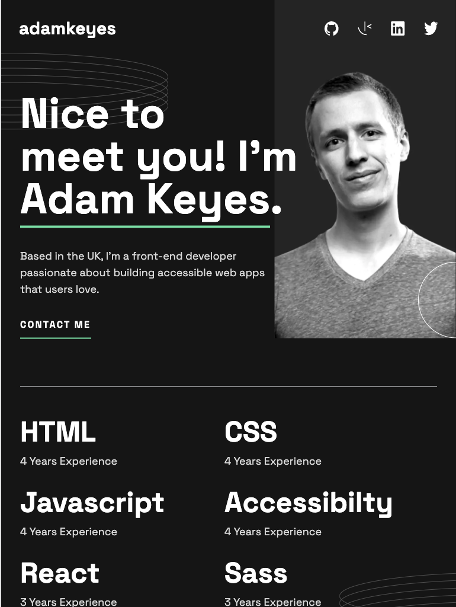
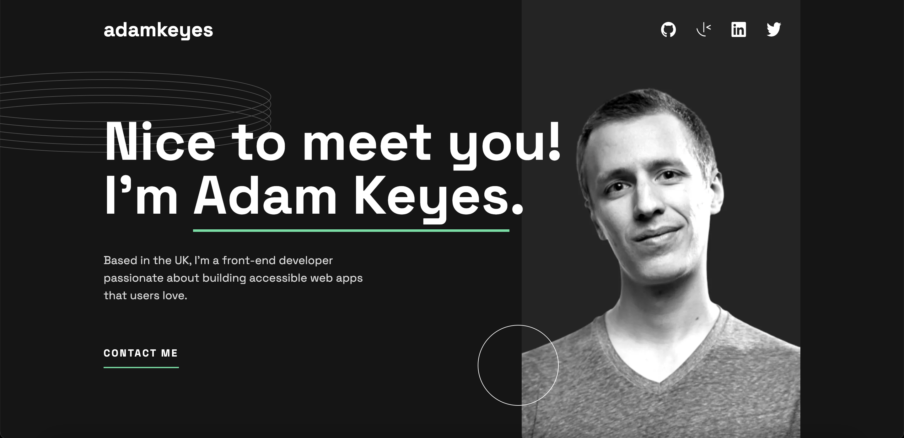

# Frontend Mentor - Single-page developer portfolio solution

This is a solution to the [Single-page developer portfolio challenge on Frontend Mentor](https://www.frontendmentor.io/challenges/singlepage-developer-portfolio-bBVj2ZPi-x). Frontend Mentor challenges help you improve your coding skills by building realistic projects.

## Table of contents

- [Overview](#overview)
  - [The challenge](#the-challenge)
  - [Screenshot](#screenshot)
  - [Links](#links)
- [My process](#my-process)
  - [Built with](#built-with)
  - [What I learned](#what-i-learned)
  - [Continued development](#continued-development)
  - [Useful resources](#useful-resources)
- [Author](#author)

**Note: Delete this note and update the table of contents based on what sections you keep.**

## Overview

### The challenge

Users should be able to:

- Receive an error message when the `form` is submitted if:
  - Any field is empty
  - The email address is not formatted correctly
- View the optimal layout for the interface depending on their device's screen size
- See hover and focus states for all interactive elements on the page

### Screenshot

### Links

- Solution URL: [Solution](https://www.frontendmentor.io/solutions/single-page-developer-portfolio-solution-htr7lORvZG)
- Live Site URL: [Live site](https://single-page-developer-portfolio-kappa.vercel.app/)

## My process

### Built with

- Semantic HTML5 markup
- CSS custom properties
- Flexbox
- CSS Grid
- Mobile-first workflow
- [React](https://reactjs.org/) - JS library
- [Formik](https://formik.org/) - Form control
- [Yup](https://github.com/jquense/yup) - For form validation
- [Tailwind](https://tailwindcss.com/) - For styles
- [Emotion Css](https://emotion.sh/docs/introduction)- For styles

### What I learned

In this coding excercise, I learnt about using various packages, like Formik, to use for form control, and also Yup for validation. I found that using tailwind for styling is very useful and I was able to use keyframes for an animation on the validation error, but it has a limit to what it can do with grid. I found I had to use emotion css to really enhance what I needed to do

### Continued development

I definitely want to use more variables for spacing in css, as I found I was writing a lot of the same spacing values.

### Useful resources

- [Formik tutorial](https://www.youtube.com/watch?v=a94FOvaBomQ&list=PLC3y8-rFHvwiPmFbtzEWjESkqBVDbdgGu) - This helped me get a grasp on how to use formik and is a really indepth resource.

## Author

- Website - [Eugene Carbado](https://www.eugenecarbado.dev/)
- Frontend Mentor - [@EugeneCarbado](https://www.frontendmentor.io/profile/EugeneCarbado)
